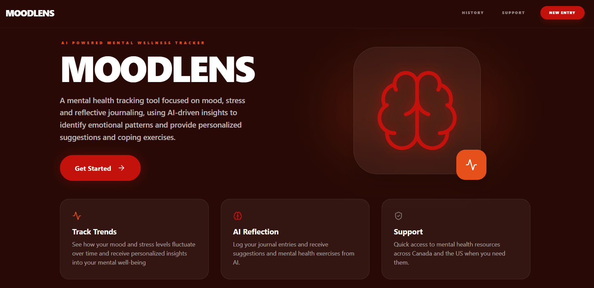
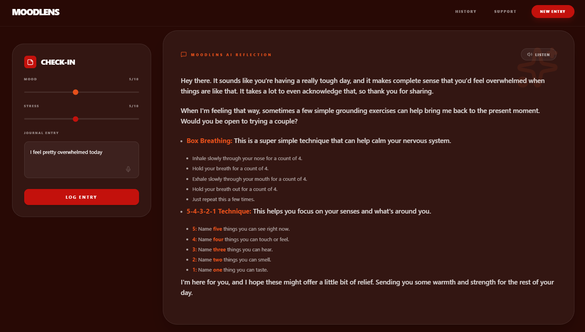
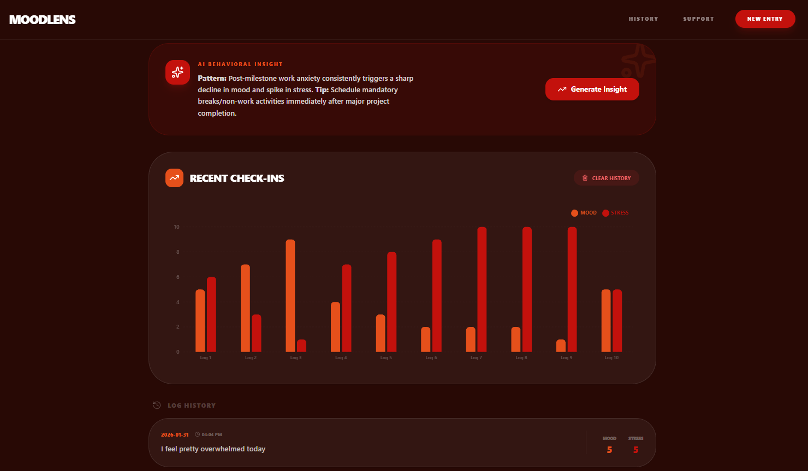
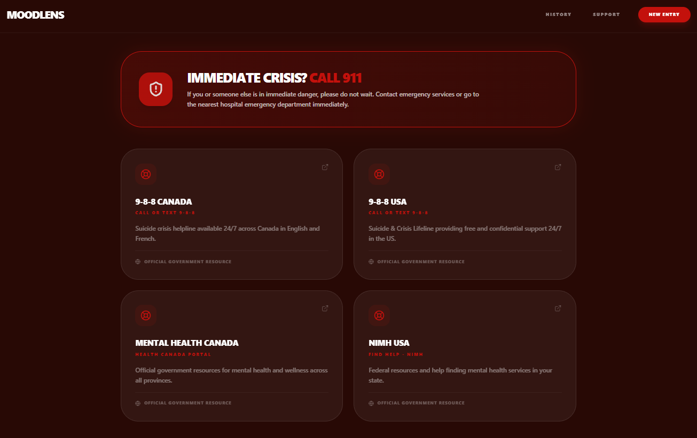
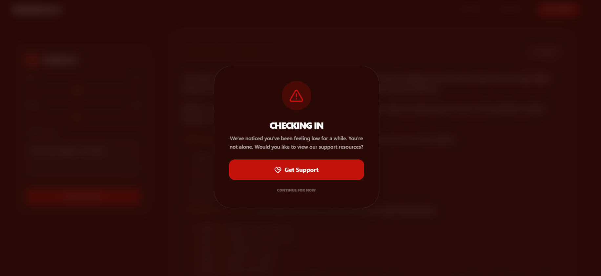

# MoodLens - AI-Powered Mental Health Tracker

MoodLens is an AI-powered mental health tracking tool focused on mood, stress and reflective journaling, using AI-driven insights to identify emotional patterns and provide personalized suggestions and coping exercises.

MoodLens is designed as a **self-reflection companion**, not a clinical product.

---

## Features

### 🧠 Intelligent Reflections
- AI-generated empathetic insights based on journal entries using **Google Gemini**  
- Supportive tone focused on reflection and coping exercises  
- Pattern recognition across mood, stress, and journal entries  

### 🎙️ Voice Capabilities – Improves Accessibility
- **Speech-to-Text (STT):** Dictate journal entries instead of typing using **Web Speech API**  
- **Text-to-Speech (TTS):** Listen to reflections read aloud using **AWS Polly**  

### 📊 Mood & Stress Tracking
- Daily mood and stress sliders  
- Review previous entries and clear history if not needed  
- Helps identify recurring emotional patterns over time using AI behavioral insights  

### 🚨 Crisis Awareness
- Detects high-risk emotional language  
- Displays a supportive resources modal when concerning patterns appear  
- Includes links to certified mental-health helplines across the **US and Canada**  

### 🎨 Clean, Modern UI
- Dark-mode focused, calming interface  
- Built with **Tailwind CSS** and **React** for responsiveness and accessibility  
- Minimal, distraction-free journaling experience  

### 🔒 Privacy-First Design
- Journal data is stored locally for privacy  
- No user accounts required  

### ⚠️ Clinical Disclaimer
MoodLens is a digital self-reflection space. It is not a therapy tool and is not intended to provide medical diagnosis, clinical advice or treatment plans. Always consult a healthcare professional for medical concerns.

---

## Tech Stack

**Frontend**
- React.js  
- Tailwind CSS  
- Lucide-React (Icons)  
- Axios  

**Backend**
- Python (FastAPI)  
- JSON-based local storage  

**AI & Voice Services**
- Google Gemini API (text reflection)  
- AWS Polly (Text-to-Speech)  
- Web Speech API (Speech-to-Text)

**Automation**
- Shell scripts (macOS / Linux)  
- Batch scripts (Windows)  

---

## Installation & Setup

This project includes automation scripts to handle dependency installation and server management across Windows, macOS, and Linux.

---

## Prerequisites
Ensure you have the following installed:

- **Node.js** (v18+) & **npm**  
- **Python** (3.10+)  
- **Git**  

---

## 1. Environment Variables
Before running the scripts, you must configure your API keys. Navigate to the `backend/` folder and create a `.env` file:

```env
GOOGLE_API_KEY=your_gemini_key
AWS_ACCESS_KEY_ID=your_aws_key
AWS_SECRET_ACCESS_KEY=your_aws_secret
AWS_REGION=us-east-1
```

## 2. Install Dependencies

You need to install the project libraries for both the backend and frontend.

### **Backend**

Open your terminal and run:

```bash
cd backend
pip install -r requirements.txt
```

### **Frontend**

Open your terminal and run:

```bash
cd frontend
npm install
```

## 3. Launch the Application

Once dependencies are installed, use the automation scripts to start both servers at once.

### **Windows Users**

1.  Locate the `run_moodlens.bat` file in the root directory.
    
2.  **Double-click** the file to launch the application.
    

### **macOS / Linux Users**

1.  Open your terminal in the root directory.
    
2.  Make the script executable by running:
```bash
chmod +x run_moodlens.sh
```
    
3.  Launch the script:
```bash
./run_moodlens.sh
```

---

## User Interface Screenshots

Here’s a quick look at the MoodLens interface:

### **Main Page**


### **Check-In Page**


### **History Page**


### **Support Page**


### **Warning Popup**


---

## References & Resources

### 🚨 Mental Health Support Links Used
- [988 Suicide & Crisis Lifeline (USA)](https://988lifeline.org/)  
- [988 Suicide Crisis Helpline (Canada)](https://988.ca/)  
- [Mental Health & Wellness (Government of Canada)](https://www.canada.ca/en/public-health/topics/mental-health-wellness.html)  
- [National Institute of Mental Health (NIMH)](https://www.nimh.nih.gov/health/find-help)  

### 🛠️ Developer Documentation
- [Google Gemini API Documentation](https://developers.generativeai.google/)  
- [AWS Polly API Reference](https://docs.aws.amazon.com/polly/latest/dg/what-is.html)  
